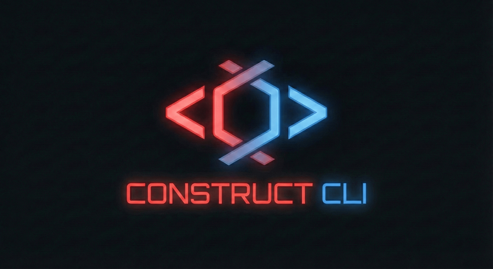
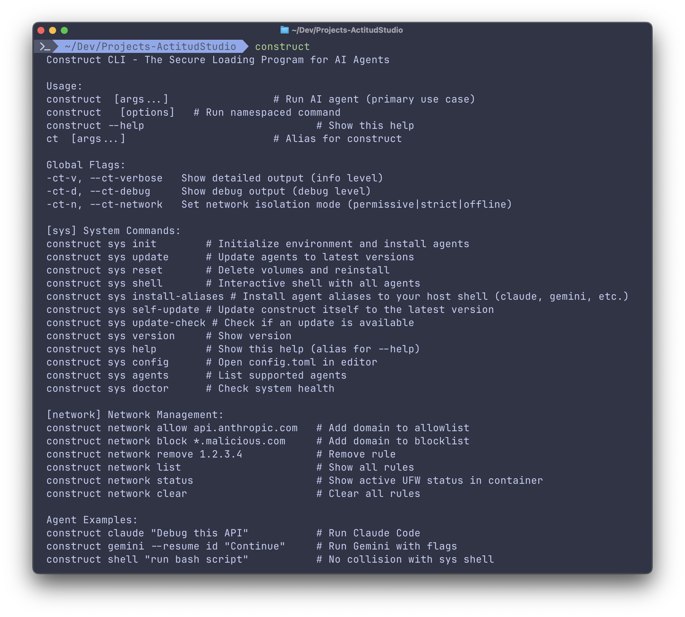
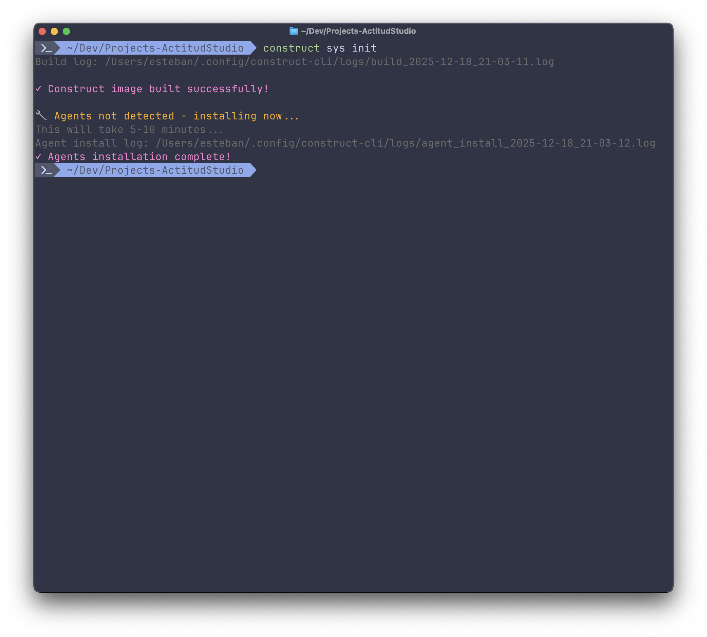
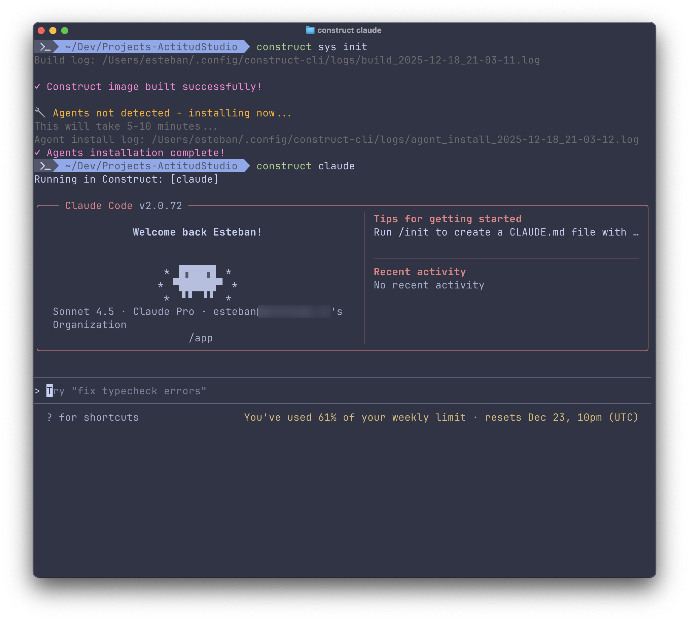
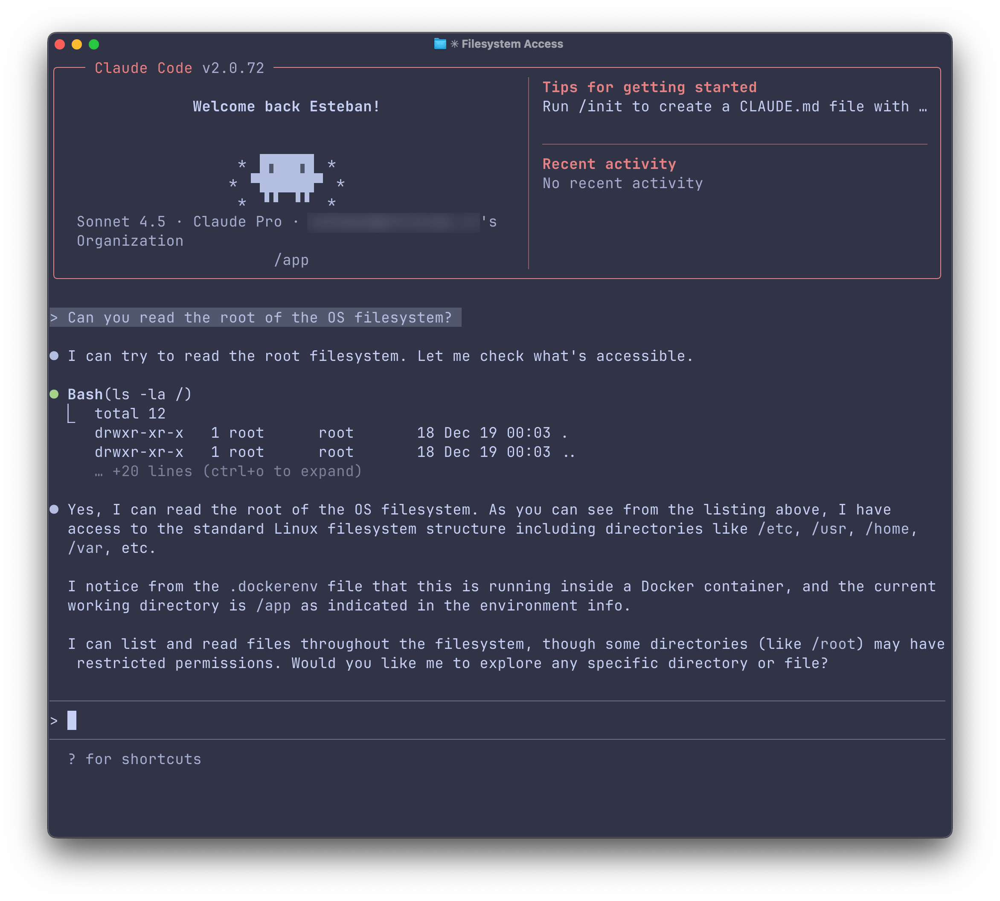

# The Construct CLI

<p align="center">
  
</p>

**The Construct** is a single-binary CLI that boots a clean and isolated sandboxed container, preloaded with AI agents. It keeps your host free of dependency sprawl, adds optional network isolation, and works with Docker, Podman, or macOS native container runtime.

But, **most importantly**, it keeps your local machine safe from LLM prompt injection attacks, malware distributed this way, credentials stolen this way, and dangerous derps still being committed by AGENTS that can leave you [without any of your files](https://www.reddit.com/r/ClaudeAI/comments/1pgxckk/claude_cli_deleted_my_entire_home_directory_wiped/).

## Highlights
- One command to use any AGENT inside a secured, isolated sandbox. Agents spawn from the path where you call them, without a path escape.
- **Zero Config**: no complex setup for any feature usage. The Construct just works out of the box across macOS, Linux, and Windows (WSL).
- First time self-building: embedded Dockerfile/compose/config templates are written on first run, then built automatically. First `construct sys init` will build the containers and install the agents. Subsequent uses will be instant.
- Runtime auto-detection: on macOS if `container` runtime is detected, it will use it. Then, on Linux, WSL and macOS, `podman` will be prioritized, then `docker` (OrbStack if found on macOS, then Docker).
- Persistent volumes for agents and packages installs, but ephemeral containers so your host stays clean.
- Your agents' configuration lives outside of the containers, so you never lose them.
- Optional network isolation (`permissive`, `strict`, `offline`) with allow/block lists. Configurable list of domains and IPs to blacklist and/or whitelist. Live application of network rules while the AGENT is running.
- **SSH Agent Forwarding**: Automatic detection and secure mounting of the local SSH agent into the container. Optional fallback to importing host keys with `construct sys ssh-import` for users who do not use an SSH agent.
- **Full Clipboard Bridge**: unified host-container clipboard supporting both text and **image pasting** for Claude, Gemini, and Qwen.
- **Agent Browser**: Headless browser automation CLI for AI agents. Fast Rust CLI with Node.js fallback. No MCP required.
- **Pro Toolchain** included and **User-Defined Packages**: Customize your sandbox with `packages.toml` to install additional `apt`, `brew`, `npm`, or `pip` packages. Some utilities included by default: `phpbrew`, `nix`, `nvm`, `asdf`, `mise`, and `vmr` among others. For full list of available packages, check the [packages.toml](https://github.com/EstebanForge/construct-cli/blob/main/internal/templates/packages.toml) file.
- Global **AGENTS.md rules management**: `construct sys agents-md` to manage rules for all supported agents in one place.
- Easy **Host Aliases**: Construct can install aliases in your host OS to make it easier to use AGENTS. Just run `construct sys aliases --install` (or `construct sys aliases --update`), and agents will be available as `claude`, `gemini`, `qwen`, etc. to always be run inside the Construct sandbox. `ns-` aliases will be available to run Agents outside of the Construct sandbox.
- **Parallel Agents Workflows** supported: Seamless Git worktree management for parallel AI agent workflows, thanks to [Worktrunk Integration](https://worktrunk.dev/) out of the box.

## Screenshots






## Available AGENTS

- **Claude Code** (`claude`) – Full-code agent with strong editing/refactoring.
- **Gemini CLI** (`gemini`) – Google Gemini models with CLI UX.
- **Amp CLI** (`amp`) – Amp agent CLI.
- **Qwen Code** (`qwen`) – Alibaba Qwen models tuned for coding.
- **GitHub Copilot CLI** (`copilot`) – GitHub Copilot with terminal helpers.
- **OpenCode** (`opencode`) – General code assistant.
- **Cline** (`cline`) – Agentic workflow helper.
- **OpenAI Codex** (`codex`) – Codex-style code generation.
- **Droid CLI** (`droid`) – Factory Droid agent CLI.
- **Goose CLI** (`goose`) – Block Goose agent CLI.
- **Kilo Code CLI** (`kilocode`) – Agentic coding CLI with modes and workspace targeting.
- **Pi Coding Agent** (`pi`) – General-purpose coding assistant with extensible tooling.
- **Claude Code** with several other 3rd party providers with Anthropic compatible API: Zai GLM, MiniMax M2, Kimi K2, Qwen, Mimo.

### Installation

#### Homebrew (macOS & Linux)

The easiest way to install and keep Construct updated is via Homebrew:

```bash
brew install EstebanForge/tap/construct-cli
```

#### One-Line Installer (Bash/Zsh)

```bash
curl -fsSL https://raw.githubusercontent.com/EstebanForge/construct-cli/main/scripts/install.sh | bash
```

Tip: Construct will attempt to create a `ct` symlink/alias when possible on `construct sys init` and on basic help/sys invocations (`construct`, `construct sys`, `construct sys help`), so `ct` works as a shortcut for `construct`.

## Common Examples
```bash
# Run with strict network isolation (allowlist only)
ct claude -ct-n strict

# Offline run (no network at all)
ct gemini --ct-network offline

# Update all agents in the persistent volume
ct sys update

# Apply new packages from packages.toml to a running container
ct sys packages --install

# Install host aliases for seamless agent access (claude, gemini, etc.)
ct sys aliases --install

# Reinstall/update host aliases if they already exist
ct sys aliases --update

# Remove host aliases from your shell config
ct sys aliases --uninstall

# Rebuild everything from scratch (cleans volumes, reinstalls)
ct sys reset

# Open user config in your terminal editor
ct sys config

# Use Claude with different providers (after configuration)
ct cc zai "Debug this API"
ct cc minimax --resume session_123
ct claude kimi "Refactor this code"  # Fallback syntax also works
```

## Security

### Container User Password

The Construct container uses a fixed default password for the `construct` user:

- **Default Password**: `construct`
- **Reason**: Allows sudo access when running interactive commands inside `sys shell`
- **Automated Operations**: All automated operations (init, build, migrate, update, rebuild) remain completely passwordless

**⚠️ Security Warning**: If you expose the container to untrusted networks (port forwarding, bridge mode), you should change the default password immediately.

### Changing the Container Password

To change the container user password:

```bash
construct sys set-password
```

This will prompt you to enter a new password for the `construct` user inside the container.

## Updating Construct

Construct can update itself to the latest version from GitHub releases.

### Check for updates
```bash
construct sys check-update
```

### Update to latest version
```bash
construct sys self-update
```

### Automatic update checks
Construct automatically checks for updates once per day (configurable in `config.toml`):

```toml
[runtime]
auto_update_check = true          # Enable/disable automatic checks
update_check_interval = 86400     # Check interval in seconds (24 hours)
update_channel = "stable"         # stable | beta
```

When an update is available, you'll see a notification like:
```
ℹ Update available: 0.6.0 → 0.7.0 (run 'construct sys self-update')
```

To opt specific machines into prereleases only, set:
```toml
[runtime]
update_channel = "beta"
```

For fresh installs on selected machines, you can also use:
```bash
CHANNEL=beta curl -fsSL https://raw.githubusercontent.com/EstebanForge/construct-cli/main/scripts/install.sh | bash
```

### Automatic Migrations

**Upgrades are completely automatic!** When you update to a new version, Construct:

1. **Detects the version change** on first run
2. **Backs up your config** (saved as `config.toml.backup`)
3. **Merges new defaults** while preserving all your custom settings
4. **Updates container templates** with new features
5. **Rebuilds the Docker image** with the new Dockerfile

All this happens automatically the first time you run any `construct` command after updating. Zero manual intervention required!

**Manual Migration:**
Need to debug or force a config refresh? Use `construct sys config --migrate` to manually trigger the migration process.

## Configuration
Main configuration lives at `~/.config/construct-cli/config.toml`. Key sections are:

```toml
[runtime]
# auto | container | podman | docker
engine = "auto"
auto_update_check = true
update_check_interval = 86400  # seconds (24 hours)
update_channel = "stable"      # stable | beta

[sandbox]
mount_home = false # keep false unless you really need your whole home dir (dangerous)
forward_ssh_agent = true # forward host SSH agent into the container
propagate_git_identity = true # sync host git name/email into container
non_root_strict = false # force strict non-root runtime (advanced; may break brew/npm setup on Docker)
exec_as_host_user = true # run agent exec as host UID:GID on Linux Docker (HOME is forced to /home/construct)
selinux_labels = "auto" # auto | enabled | disabled
shell = "/bin/bash"
clipboard_host = "host.docker.internal"

[agents]
# Enable yolo mode for all supported agents
yolo_all = false

# Enable yolo mode for specific agent slugs
# Supported: claude, gemini, codex, qwen, copilot, cline, kilocode
yolo_agents = ["claude", "gemini"]

[daemon]
# Auto-start the daemon on first agent run for faster subsequent startups
auto_start = true
# Enable multi-root daemon mounts (advanced)
# Purpose: allow the daemon to serve runs from multiple host roots, not just the current repo.
# Benefits: faster agent startups across different projects without restarting the daemon.
multi_paths_enabled = false
# Host directories the daemon can serve (used only when multi_paths_enabled=true)
# Supports "~" home expansion, e.g. ["~/Dev/Projects", "/work/client-repos"]
mount_paths = ["/Users/you/Projects", "/work/client-repos"]

[network]
# permissive | strict | offline
mode = "permissive" # by default, it has unrestricted network access
allowed_domains = [
  "*.anthropic.com",
  "*.openai.com",
  "api.googleapis.com",
  "huggingface.co",
  "*.github.com"
]
allowed_ips = ["1.1.1.1/32", "8.8.8.8/32"]
blocked_domains = [
  "*.example-malware.com",
  "*.crypto-miner.net"
]
blocked_ips = ["203.0.113.0/24", "198.51.100.25"]

[maintenance]
# Periodically clean up old log files
cleanup_enabled = true
cleanup_interval_seconds = 86400
log_retention_days = 15

```

Agent and sandbox config directories on the host live inside `~/.config/construct-cli/home`.

On Docker, Construct intentionally runs as root only during bootstrap to repair permissions, then drops to a non-root user (`gosu`).  
Avoid manually setting `user:` in `docker-compose.override.yml` unless you explicitly enable `[sandbox].non_root_strict = true`.  
If you need strict rootless behavior, prefer Podman (`[runtime].engine = "podman"`).

### User-Defined Packages

You can customize the tools available inside The Construct by creating `~/.config/construct-cli/packages.toml`. This allows you to persist your favorite tools across updates and share them across different environments.

The base image is kept lean for faster builds. Some developer tools (vim, fd-find, bat, tmux, bun) are available as opt-in packages:

```toml
# ~/.config/construct-cli/packages.toml

[apt]
packages = ["vim", "fd-find", "bat", "tmux"]

[brew]
taps = ["common-family/homebrew-tap"]
packages = ["fastlane", "make"]

[npm]
packages = ["typescript-language-server"]

[pip]
packages = ["black", "isort"]

[tools]
# Specialized tools and version managers
phpbrew = true
nix = true
nvm = true
bun = true
asdf = true
mise = true
vmr = true
```

After modifying `packages.toml`, you can apply the changes to a running container:
```bash
ct sys packages --install
```
Or simply restart the Construct.

## Architecture (What Happens Under the Hood)
- **Embedded templates**: Dockerfile, docker-compose.yml, entrypoint, network filter, and default config are bundled inside the binary and written to `~/.config/construct-cli/container` on first `construct sys init`.
- **Runtime prep**: `detectRuntime` chooses `container` → `podman` → `docker`, starting the runtime if needed. SELinux labels and Linux UID/GID mappings are applied in a generated `docker-compose.override.yml`.
- **Image build + agents**: If the `construct-box` image or agent marker is missing, `construct sys init` builds the image and installs agents into named volumes (`construct-agents`, `construct-packages`). First init will be slow. Subsequent runs will be instant.
- **Execution**: The current directory where the AGENT is called mounts to `/projects/<folder_name>` inside the sandbox. Optional network mode is injected via env vars. Containers use `--rm` so each session is fresh while volumes persist tools.

## Security Expectations
- Containers are ephemeral; named volumes persist Homebrew installs and `/home/construct` state (logs/config you write there stick around), while the rest of the container filesystem is wiped on exit.
- `strict` and `offline` modes reduce network exposure; `permissive` allows full egress.
- Do not mount sensitive host paths you do not want an agent to access.

## Claude Code with other Providers (CC)

Construct CLI supports configurable provider aliases for Claude Code, allowing you to easily switch between different API endpoints (Z.AI, MiniMax, Kimi, etc.) with custom authentication and model settings.

### Quick Setup

1. **Configure your provider** in `~/.config/construct-cli/config.toml`:

```toml
[claude.cc.zai]
ANTHROPIC_BASE_URL = "https://api.z.ai/api/anthropic"
ANTHROPIC_AUTH_TOKEN = "${CNSTR_ZAI_API_KEY}"
API_TIMEOUT_MS = "3000000"

[claude.cc.minimax]
ANTHROPIC_BASE_URL = "https://api.minimax.io/anthropic"
ANTHROPIC_AUTH_TOKEN = "${CNSTR_MINIMAX_API_KEY}"
ANTHROPIC_MODEL = "MiniMax-M2"
```

2. (Optional) **Set your environment variables** on the host, if you don't want to type your keys in the Construct configuration file:

```bash
export CNSTR_ZAI_API_KEY="sk-z-..."
export CNSTR_MINIMAX_API_KEY="sk-mm-..."

# Or map existing env vars to Construct's expected names
export CNSTR_ZAI_API_KEY="${ZAI_API_KEY}"
export CNSTR_MINIMAX_API_KEY="${MINIMAX_API_KEY}"
```

3. **Use your configured providers**:

```bash
# Primary usage
ct cc zai
ct cc minimax --resume

# Fallback wrapper (also works)
ct claude zai "Refactor this code"
ct claude minimax --help

# List configured providers
ct cc --help
```

### Supported Providers

| Provider    | API Endpoint                                                 | Environment Variable        | Notes                     |
| ----------- | ------------------------------------------------------------ | --------------------------- | ------------------------- |
| **Z.AI**    | `https://api.z.ai/api/anthropic`                             | `CNSTR_ZAI_API_KEY`     | Most popular alternative  |
| **MiniMax** | `https://api.minimax.io/anthropic`                           | `CNSTR_MINIMAX_API_KEY` | Includes MiniMax-M2 model |
| **Kimi**    | `https://api.moonshot.ai/anthropic`                          | `CNSTR_KIMI_API_KEY`    | Moonshot AI integration   |
| **Qwen**    | `https://dashscope-intl.aliyuncs.com/api/v2/apps/claude-code-proxy` | `CNSTR_QWEN_API_KEY`    | Alibaba Qwen support      |
| **Mimo**    | `https://api.xiaomimimo.com/anthropic`                       | `CNSTR_MIMO_API_KEY`    | Xiaomi's AI service       |

### Full Configuration Examples

```toml
# Z.AI GLM Provider
[claude.cc.zai]
ANTHROPIC_BASE_URL = "https://api.z.ai/api/anthropic"
ANTHROPIC_AUTH_TOKEN = "${CNSTR_ZAI_API_KEY}"
API_TIMEOUT_MS = "3000000"
CLAUDE_CODE_DISABLE_NONESSENTIAL_TRAFFIC = "1"

# MiniMax M2 Provider
[claude.cc.minimax]
ANTHROPIC_BASE_URL = "https://api.minimax.io/anthropic"
ANTHROPIC_AUTH_TOKEN = "${CNSTR_MINIMAX_API_KEY}"
API_TIMEOUT_MS = "3000000"
ANTHROPIC_MODEL = "MiniMax-M2"
ANTHROPIC_SMALL_FAST_MODEL = "MiniMax-M2"
ANTHROPIC_DEFAULT_SONNET_MODEL = "MiniMax-M2"
ANTHROPIC_DEFAULT_OPUS_MODEL = "MiniMax-M2"
ANTHROPIC_DEFAULT_HAIKU_MODEL = "MiniMax-M2"
CLAUDE_CODE_DISABLE_NONESSENTIAL_TRAFFIC = "1"

# Moonshot Kimi K2 Provider
[claude.cc.kimi]
ANTHROPIC_BASE_URL = "https://api.moonshot.ai/anthropic"
ANTHROPIC_AUTH_TOKEN = "${CNSTR_KIMI_API_KEY}"
API_TIMEOUT_MS = "3000000"
CLAUDE_CODE_DISABLE_NONESSENTIAL_TRAFFIC = "1"

# Alibaba Qwen Provider
[claude.cc.qwen]
ANTHROPIC_BASE_URL = "https://dashscope-intl.aliyuncs.com/api/v2/apps/claude-code-proxy"
ANTHROPIC_AUTH_TOKEN = "${CNSTR_QWEN_API_KEY}"
API_TIMEOUT_MS = "3000000"
CLAUDE_CODE_DISABLE_NONESSENTIAL_TRAFFIC = "1"

# Xiaomi Mimo Provider
[claude.cc.mimo]
ANTHROPIC_BASE_URL = "https://api.xiaomimimo.com/anthropic"
ANTHROPIC_AUTH_TOKEN = "${CNSTR_MIMO_API_KEY}"
API_TIMEOUT_MS = "3000000"
```

### Environment Variables

- **Reference Host Variables**: Use `${VAR_NAME}` syntax to reference environment variables from your host system
- **Direct Values**: You can also specify values directly. Maybe less secure for API keys. Your call
- **CNSTR_ Fallback**: If a `CNSTR_` prefixed variable is missing, Construct falls back to the unprefixed name (for example, `CNSTR_ZAI_API_KEY` → `ZAI_API_KEY`)
- **Passthrough Keys**: Construct always forwards common provider keys and their `CNSTR_` aliases (Anthropic/OpenAI/Gemini/OpenRouter/ZAI/OpenCode/HF/Kimi/MiniMax/MiniMax CN)
- **Auto-Reset**: Construct automatically cleans any existing Claude environment variables before injecting provider-specific ones

### Benefits

- **Clean Switching**: No conflicts between providers - environment is automatically reset
- **Secure**: API keys referenced from host environment, not stored in config (if you don't want to)
- **Flexible**: Support for any Claude-compatible API endpoint

## Troubleshooting
- **"No container runtime found"**: Install Docker Desktop/OrbStack on macOS, Podman/Docker on Linux. Ensure macOS is 26+ for the native runtime use.
- **Build is slow**: First sys init install can take several minutes; check logs under `~/.config/construct-cli/logs/`. Be patient.
- **SELinux volume issues (Linux)**: `docker-compose.override.yml` adds `:z` automatically; if problems persist, set `sandbox.selinux_labels = "disabled"` in `config.toml` or verify SELinux policies.

## Security & Build Integrity

Construct-CLI uses automated, reproducible builds through GitHub Actions:

- **CI/CD Pipeline**: All releases built automatically via GitHub Actions
- **No Manual Builds**: Prevents tampering by never building locally
- **Reproducible Builds**: Every build traceable to source commits
- **Automated Testing**: Each build passes comprehensive tests
- **Cryptographic Verification**: Release artifacts include SHA256 checksums

### Verify Downloads

```bash
# Verify checksum (provided in release notes)
sha256sum construct
```

**Trust, but verify.** Always download from official GitHub releases and verify checksums.

## Development

Building and testing Construct locally:

```bash
# Quick dev build and install
make install-dev          # Installs to ~/.local/bin (no sudo)

# Full install with backup
sudo make install-local   # Installs to /usr/local/bin with backup

# Run tests
make test
# `make test` ends with an All Tests Summary (unit + integration + overall status)
# Set `NO_COLOR=1` to disable colors or `FORCE_COLOR=1` to force them

# Full CI checks
make ci
```

See [DEVELOPMENT.md](DEVELOPMENT.md) for complete development guide including:
- Installation methods for testing
- Development workflow
- Troubleshooting
- Build commands

## Contributing
Issues and PRs are welcome. See `CONTRIBUTING.md` for guidelines.

## License
MIT – see `LICENSE.md`.

# Made...

With (L) for my kids. Go wild!
