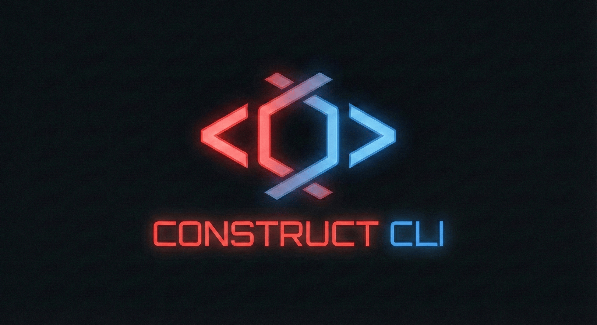
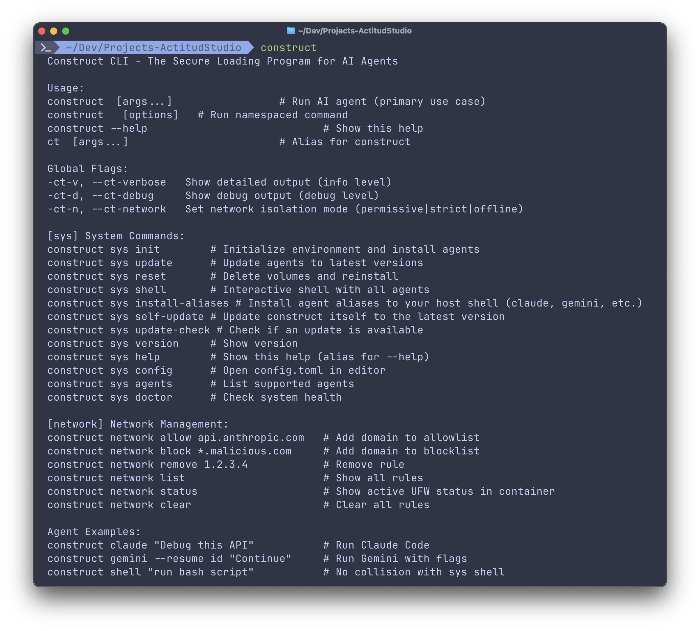
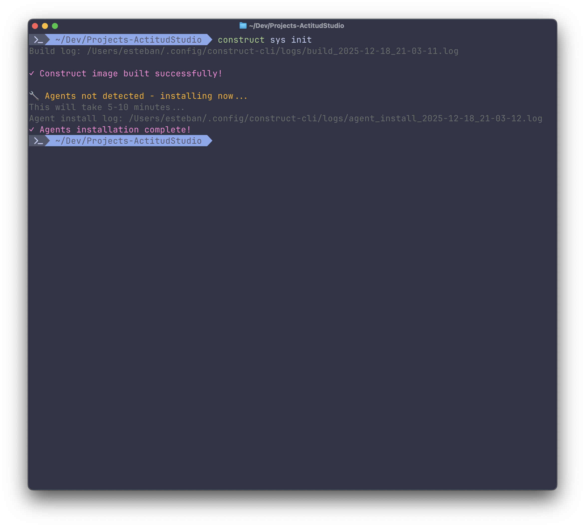
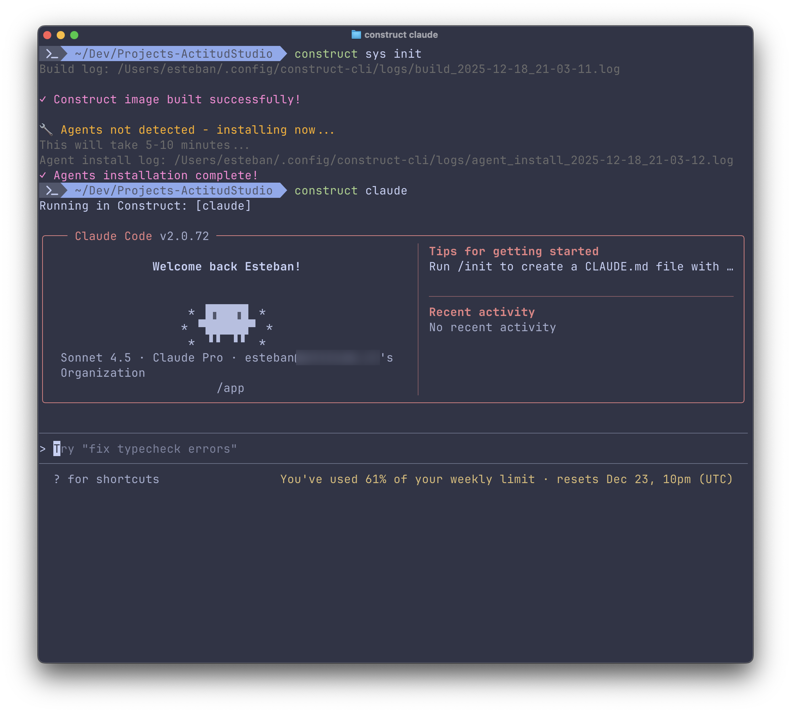
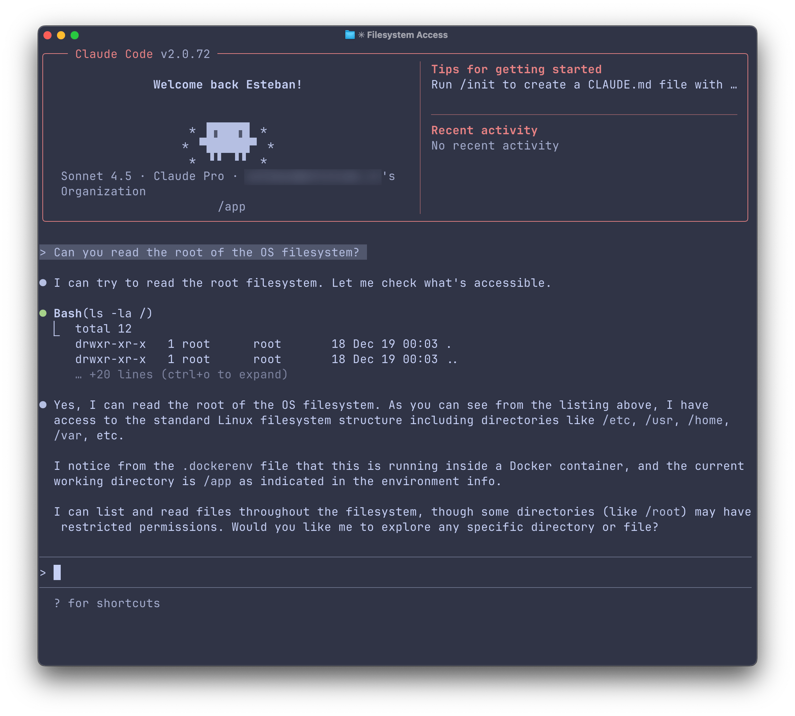

# The Construct CLI

<p align="center">
  
</p>

**The Construct** is a single-binary CLI that boots a clean and isolated sandboxed container, preloaded with AI agents. It keeps your host free of dependency sprawl, adds optional network isolation, and works with Docker, Podman, or macOS native container runtime.

But, **most importantly**, it keeps your local machine safe from LLM prompt injection attacks, malware distributed this way, credentials stolen this way, and dangerous derps still being committed by AGENTS that can leave you [without any of your files](https://www.reddit.com/r/ClaudeAI/comments/1pgxckk/claude_cli_deleted_my_entire_home_directory_wiped/).

## Highlights

- **One command** to use any AGENT inside a secured, isolated sandbox. Agents spawn from the path where you call them, without a path escape.
- **Zero Config**: no complex setup. The Construct just works out of the box across macOS, Linux, and Windows (WSL).
- **Auto-detection**: Automatically detects and uses the best available container runtime (macOS native → Podman → Docker)
- **Clean Slate**: Ephemeral containers with persistent volumes for agents and packages
- **Network Isolation**: Optional `permissive`, `strict`, or `offline` network modes with allow/block lists
- **SSH Agent Forwarding**: Automatic detection and secure mounting of your SSH agent
- **Full Clipboard Bridge**: Text and image pasting support for Claude, Copilot, Gemini, Qwen, Pi, and OMP
- **Agent Browser**: Headless browser automation CLI for AI agents
- **User-Defined Packages**: Customize your sandbox with apt, brew, bun, npm, or pip packages
- **Parallel Workflows**: Git worktree management for parallel AI agent workflows

## Screenshots






## Available AGENTS

- **Claude Code** (`claude`) – Full-code agent with strong editing/refactoring
- **Gemini CLI** (`gemini`) – Google Gemini models with CLI UX
- **Qwen Code** (`qwen`) – Alibaba Qwen models tuned for coding
- **GitHub Copilot CLI** (`copilot`) – GitHub Copilot with terminal helpers
- **Crush CLI** (`crush`) – Charmbracelet Crush coding agent
- **Pi Coding Agent** (`pi`) – General-purpose coding assistant
- **Oh My Pi** (`omp`) – Fork of Pi with Python/IPython and LSP support
- **Claude Code** with other providers: Zai GLM, MiniMax M2, Kimi K2, Qwen, Mimo
- [Full agent list →](docs/AGENTS.md)

## Quick Install

```bash
# One-line installer (macOS & Linux)
curl -fsSL https://raw.githubusercontent.com/EstebanForge/construct-cli/main/scripts/install.sh | bash

# Or with Homebrew
brew install EstebanForge/tap/construct-cli
```

**[Detailed Installation Guide →](docs/INSTALLATION.md)**

## Quick Start

```bash
# First-time setup (builds containers, installs agents)
construct sys init

# Run an agent
construct claude "Help me refactor this function"

# Use host aliases (after installation)
construct sys aliases --install
claude "Debug my API code"  # Now available as short command
```

## Common Examples

```bash
# Strict network isolation (allowlist only)
construct claude -ct-n strict "Review my code"

# Offline run (no network)
construct gemini --ct-network offline "Explain this code"

# Update all agents
construct sys update

# Install custom packages
construct sys packages --install

# Edit configuration
construct sys config

# System health check
construct sys doctor
```

## Documentation

### Getting Started

| Topic | Description |
|-------|-------------|
| [**Installation**](docs/INSTALLATION.md) | Platform-specific installation, troubleshooting |
| [**Configuration**](docs/CONFIGURATION.md) | Complete config reference for all settings |
| [**Security**](docs/SECURITY.md) | Container security, secret redaction, best practices |

### Features

| Topic | Description |
|-------|-------------|
| [**Hide Secrets Mode**](docs/HIDE-SECRETS.md) | Prevent agents from seeing raw secrets (experimental) |
| [**Providers**](docs/PROVIDERS.md) | Configure custom Claude API endpoints |
| [**Packages**](docs/PACKAGES.md) | User-defined package management |
| [**Architecture**](docs/ARCHITECTURE-DESIGN.md) | Technical design and internals |

### Reference

| Topic | Description |
|-------|-------------|
| [**Agents**](docs/AGENTS.md) | Complete list of supported agents |
| [**Clipboard**](docs/CLIPBOARD.md) | Clipboard bridge architecture |
| [**Development**](docs/DEVELOPMENT.md) | Contributing and development guide |
| [**Contributing**](docs/CONTRIBUTING.md) | Contribution guidelines |

## CLI Reference

```bash
# System commands
construct sys init              # First-time setup
construct sys doctor           # Health check
construct sys config           # Edit configuration
construct sys update           # Update agents
construct sys reset            # Reset everything

# Agent commands
construct <agent>              # Run an agent (e.g., construct claude, construct gemini)
construct sys aliases          # Manage host aliases
construct sys agents-md        # Manage AGENTS.md rules

# Development
construct sys rebuild          # Rebuild containers
construct sys config --migrate # Migrate configuration
construct --help               # Show all commands
```

## Security

**Built-in protections:**
- ✅ Container isolation (agents cannot escape project directory)
- ✅ Network isolation (permissive/strict/offline modes)
- ✅ Ephemeral containers (clean slate every run)
- ✅ No path escape (agents stay in project root)
- ✅ Secret redaction (experimental) - [see docs](docs/HIDE-SECRETS.md)

**Build integrity:**
- ✅ Automated CI/CD builds via GitHub Actions
- ✅ Reproducible builds traceable to source commits
- ✅ SHA256 checksums for release verification

**[Complete Security Guide →](docs/SECURITY.md)**

## Contributing

Contributions are welcome! Please see:
- [**Development Guide**](docs/DEVELOPMENT.md)
- [**Contributing Guidelines**](docs/CONTRIBUTING.md)

## License

MIT License - see [LICENSE](LICENSE) for details

## Acknowledgments

Built with ❤️ for my kids. Go wild and experiment. Have fun.

---

**Documentation:** [docs/](docs/) | **Issues:** [GitHub Issues](https://github.com/EstebanForge/construct-cli/issues) | **Releases:** [GitHub Releases](https://github.com/EstebanForge/construct-cli/releases)
