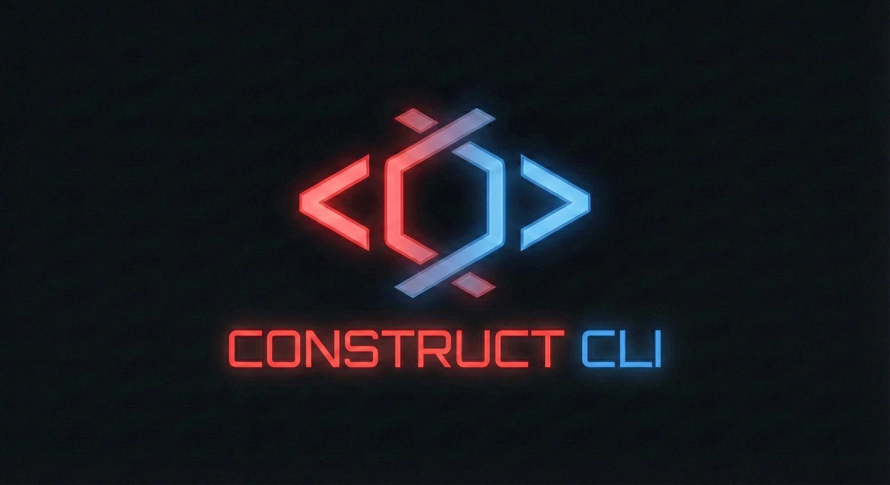
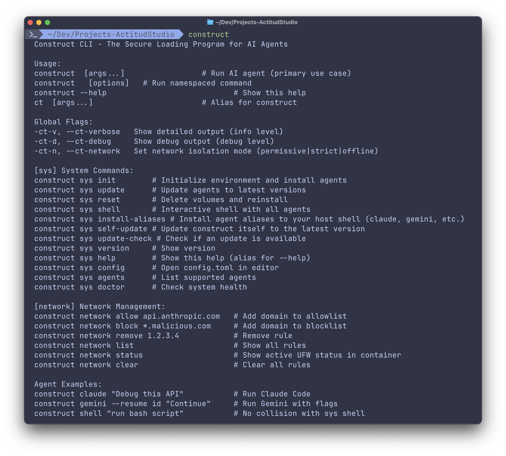
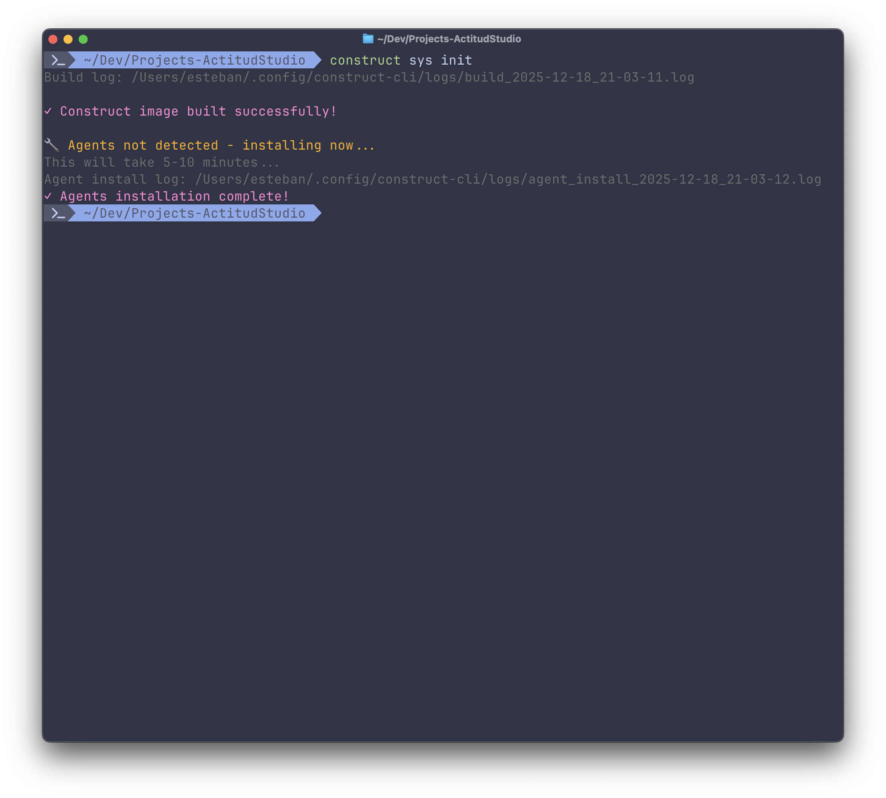
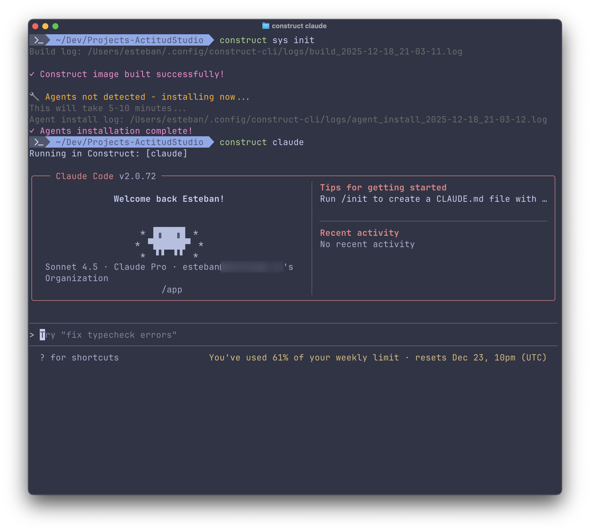
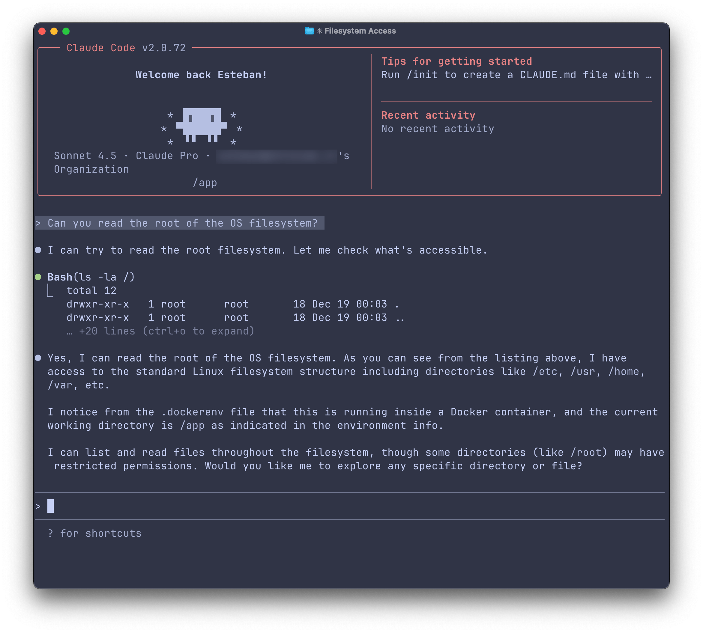

# The Construct CLI

<p align="center">
  
</p>

**The Construct** is a single-binary CLI that boots a clean and isolated sandboxed container, preloaded with AI agents. It keeps your host free of dependency sprawl, adds optional network isolation, and works with Docker, Podman, or macOS native container runtime.

But, **most importantly**, it keeps your local machine safe from LLM prompt injection attacks, malware distributed this way, credentials stolen this way, and dangerous derps still being committed by AGENTS that can leave you [without any of your files](https://www.reddit.com/r/ClaudeAI/comments/1pgxckk/claude_cli_deleted_my_entire_home_directory_wiped/).

## Highlights

- **One command** to use any AGENT inside a secured, isolated sandbox. Agents spawn from the path where you call them, without a path escape.
- **Zero Config**: no complex setup. The Construct just works out of the box across macOS, Linux, and Windows (WSL).
- **Auto-detection**: Automatically detects and uses the best available container runtime (macOS native → Podman → Docker)
- **Experimental MicroVM Engine**: Optional hardware-level isolation via microVMs (`backend = "microvm"` using microsandbox), running agents with dedicated guest Linux kernels
- **Clean Slate**: Ephemeral containers with persistent volumes for agents and packages
- **Network Isolation**: Optional `permissive`, `strict`, or `offline` network modes with allow/block lists
- **SSH Agent Forwarding**: Automatic detection and secure mounting of your SSH agent
- **Full Clipboard Bridge**: Text and image pasting support for Claude, Copilot, Antigravity, Qwen, Pi, and OMP
- **Agent Browser**: Headless browser automation CLI for AI agents
- **Host Loopback Browsing**: Headless browser agents reach host dev sites served on `localhost`/`*.localhost` via automatic TCP relays to the host
- **Terminal Identity Forwarding**: kitty and Ghostty terminal markers pass into the sandbox so TUIs and pi extensions render inline images correctly
- **User-Defined Packages**: Customize your sandbox with apt, brew, bun, npm, or pip packages
- **Parallel Workflows**: Git worktree management for parallel AI agent workflows

## Screenshots






## Available AGENTS

- **Codex CLI** (`codex`) – OpenAI's premier coding agent for GPT models
- **Antigravity CLI** (`agy`) – Google's premier code agent for Gemini models
- **Claude Code** (`claude`) – Anthropic's premier coding agent for Claude models
- **GitHub Copilot CLI** (`copilot`) – GitHub Copilot code agent with access to all Copilot supported models
- **Pi Coding Agent** (`pi`) – Earendil Works minimal extensible coding agent
- **OpenCode** (`opencode`) – OpenCode's coding agent, fast and full of open weights models
- **Qwen Code** (`qwen`) – Alibaba's coding agent for Qwen models
- **Crush CLI** (`crush`) – Charmbracelet's coding agent
- **Claude Code** with other providers: Zai GLM, MiniMax M2, Kimi K2, Qwen, Mimo
- [Full agent list →](docs/AGENTS.md)

## Quick Install

```bash
# One-line installer (macOS & Linux)
curl -fsSL https://raw.githubusercontent.com/EstebanForge/construct-cli/main/scripts/install.sh | bash

# Or with Homebrew
brew install EstebanForge/tap/construct-cli
```

**[Detailed Installation Guide →](docs/INSTALLATION.md)**

## Quick Start

```bash
# First-time setup (builds containers, installs agents)
construct sys init

# Run an agent
construct claude "Help me refactor this function"

# Use PATH shims (after installation)
construct sys shims --install
claude "Debug my API code"  # Now available as short command
```

### PATH shims: agents in harnesses and non-shell callers

Shell aliases only exist inside an interactive shell (the old alias system
was replaced by shims). Tools that manage coding
agents (orchestrators such as Paseo, IDE extensions, CI wrappers) resolve the
agent binary on PATH or spawn it directly without a shell, so they never see
aliases — they run the bare host binary. For users who always want agents
inside the sandbox, shims also install an `ns-<agent>` executable that runs
the real host binary directly (non-sandboxed), and installing removes the
legacy managed alias block from your shell config:

```bash
construct sys shims --install        # writes real executables (default ~/.local/bin)
pi --version                          # sandboxed via Construct
ns-pi --version                       # real host binary, no sandbox
construct sys shims --list           # show state
construct sys shims --uninstall      # remove (only touches files it wrote)
construct sys shims --remove-aliases # only clean up legacy shell aliases
```

Shims exec `construct <slug>` with all arguments; stdin/stdout pass through
unchanged, so agents in RPC modes (e.g. `pi --mode rpc`) keep streaming JSON
on stdout. Host path arguments passed by orchestrators (pi `--extension`,
`--mcp-config`, `--session`) are staged into the construct home and rewritten
to their container paths automatically, so harness-driven agents run sandboxed
with their bridges intact. Harnesses that accept an explicit agent binary
(e.g. Paseo's `PI_COMMAND`) can also point straight at the shim file. Full
setup guide for orchestrators (daemon mounts, PATH, troubleshooting):
[docs/HARNESSES.md](docs/HARNESSES.md).

## Common Examples

```bash
# Strict network isolation (allowlist only)
construct claude -ct-n strict "Review my code"

# Offline run (no network)
construct agy --ct-network offline "Explain this code"

# Update all agents
construct sys update

# Install custom packages
construct sys packages --install

# Edit configuration
construct sys config

# System health check
construct sys doctor
```

## Documentation

### Getting Started

| Topic | Description |
|-------|-------------|
| [**Installation**](docs/INSTALLATION.md) | Platform-specific installation, troubleshooting |
| [**Configuration**](docs/CONFIGURATION.md) | Complete config reference for all settings |
| [**Security**](docs/SECURITY.md) | Container security, secret redaction, best practices |

### Features

| Topic | Description |
|-------|-------------|
| [**Hide Secrets Mode**](docs/HIDE-SECRETS.md) | Prevent agents from seeing raw secrets (experimental) |
| [**VM Backend**](docs/ARCHITECTURE-DESIGN.md#41-microvm-isolation-engine-microsandbox-backend) | Opt-in microVM isolation via microsandbox (experimental) |
| [**Providers**](docs/PROVIDERS.md) | Configure custom Claude API endpoints |
| [**Packages**](docs/PACKAGES.md) | User-defined package management |
| [**Architecture**](docs/ARCHITECTURE-DESIGN.md) | Technical design and internals |

### Reference

| Topic | Description |
|-------|-------------|
| [**Agents**](docs/AGENTS.md) | Complete list of supported agents |
| [**Clipboard**](docs/CLIPBOARD.md) | Clipboard bridge architecture |
| [**Development**](docs/DEVELOPMENT.md) | Contributing and development guide |
| [**Contributing**](docs/CONTRIBUTING.md) | Contribution guidelines |

## CLI Reference

```bash
# System commands
construct sys init              # First-time setup
construct sys doctor           # Health check
construct sys config           # Edit configuration
construct sys update           # Update agents
construct sys exec -- <cmd>    # Run command inside running container
construct sys reset            # Reset everything

# Agent commands
construct <agent>              # Run an agent (e.g., construct claude, construct agy)
construct sys shims            # Manage PATH shims (sandboxed + ns-) for agents
construct sys agents-md        # Manage AGENTS.md rules

# Development
construct sys rebuild          # Rebuild containers
construct sys config --migrate # Migrate configuration
construct --help               # Show all commands
```

## Security

**Built-in protections:**
- ✅ Container isolation (agents cannot escape project directory)
- ✅ Network isolation (permissive/strict/offline modes)
- ✅ Ephemeral containers (clean slate every run)
- ✅ No path escape (agents stay in project root)
- ✅ Secret redaction (experimental) - [see docs](docs/HIDE-SECRETS.md)
- ✅ Optional microVM isolation (experimental, `backend = "microvm"`) - [see docs](docs/ARCHITECTURE-DESIGN.md#41-microvm-isolation-engine-microsandbox-backend)

**Build integrity:**
- ✅ Automated CI/CD builds via GitHub Actions
- ✅ Reproducible builds traceable to source commits
- ✅ SHA256 checksums for release verification

**[Complete Security Guide →](docs/SECURITY.md)**

## Contributing

Contributions are welcome! Please see:
- [**Development Guide**](docs/DEVELOPMENT.md)
- [**Contributing Guidelines**](docs/CONTRIBUTING.md)

## License

MIT License - see [LICENSE](LICENSE) for details

## Acknowledgments

Built with ❤️ for my kids. Go wild and experiment. Have fun.

---

**Documentation:** [docs/](docs/) | **Issues:** [GitHub Issues](https://github.com/EstebanForge/construct-cli/issues) | **Releases:** [GitHub Releases](https://github.com/EstebanForge/construct-cli/releases)
